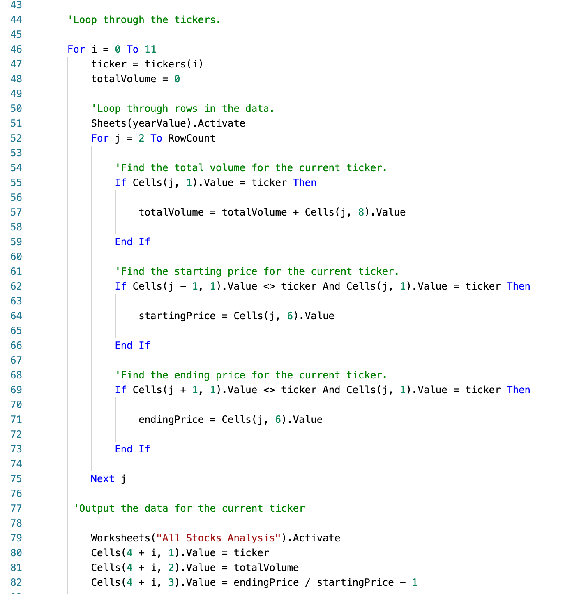
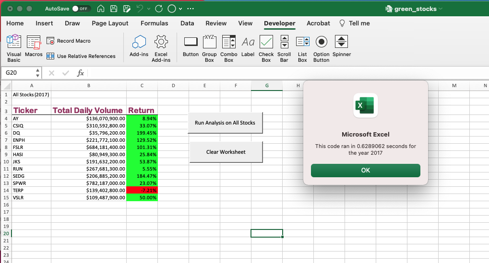
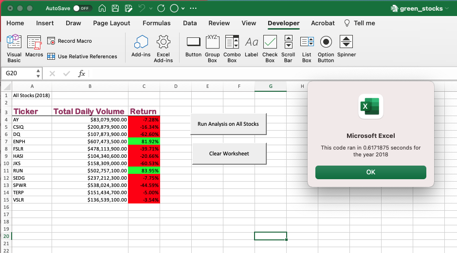
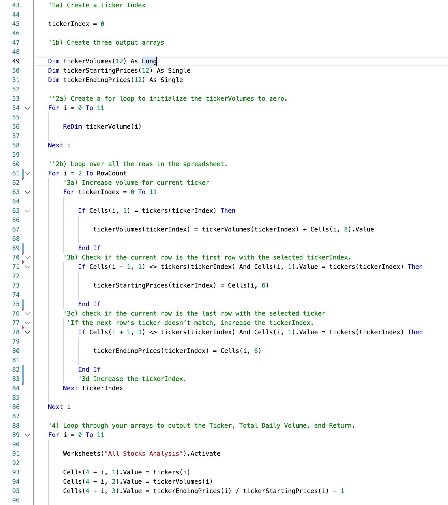
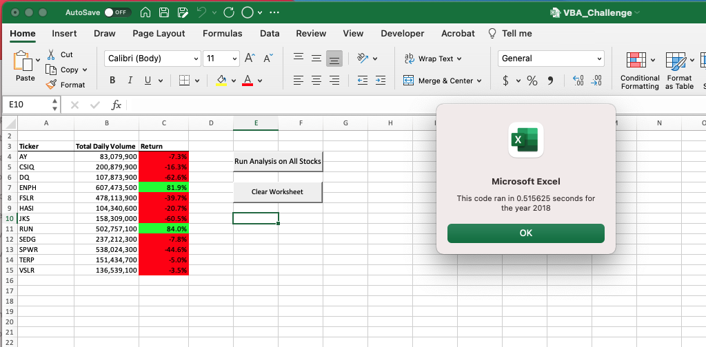

# Green Stock VBA Analysis
___

## Project Overview

### Introduction

This project was created to illustrate the use of macros developed using VBA for Excel can be used to automate the collection and visualization of data from a select group of green energy stocks.  This was used to show the capability of using macros and how they could be automated using graphic interfaces such as buttons to allow for repeatable use of the task.  For this project were used stock data of 12 stocks collected in 2017 and 2018.  The data being used included the ticker code, opening and closing stock values and daily trading volume for each day.  From this we could determine the first and last stock price and the overall trading volume for each stock being analyzed. 

### Use of Refactoring

Another goal of this project was to look at how to improved the efficency of the code using refactoring to optimize the computing power needed to complete the macros.  For this we used our initial version of the code which was functional but required the program to complete an itteration of the entire data set for each stock ticker we were looking to analyze.  The goal was to develop a refactored version of the original code that required the program to only complete on itteration of the data set and obtain the same data as the first version.

___

## Results

### Initial Code

To start we developed functional code that allowed for the collection of the total annual stock volume and the year over year performance of each stock we were looking to analyze.  As seen in the code we provided below the data was collected for each stock by completing an itteration of the dataset and inserting the data into the Excel worksheet before moving to the next stock.  

### Execution time

Imbedded into the code was a timer that would display the time it took for the program to run and show the results.  Using this we can compare the time required to complete the inital code to gather the data for the datasets for each year.  This provided us a execution time for the code for each year as seen in the images belowr.  It shows that the initial code took 0.6289062 seconds to complete the 2017 dataset and 0.6171875 to complete the 2018 dataset.

     

### Refactored Code

Through refactoring of the original working code, a more efficient use of computing can be accomplished by reducting the number of total itterations of the data set which results an increase in the speed of the execution of the task.  To refactor this code, two components were need to be added to the macro being developed.  The first was an index for each ticker that would be itterated for each line of data in the datasets being analyzed.  This ment for each line of of data within the dataset the program would identify which ticker was present and store the relevent data related to the index value.  The second was a collection of data arrays to store the multiple data points for each stock ticker.  As each value saved in the array could be retrieved based on the order that they were collected it was possible to link this data back to the ticker index used.  Using these two tools allowed the refactoring of the code as seen in the sample below.

### Execution time

Using the same code used to determine the execution time of the initial code it was possible to see if there was any improvement in the execution time observed in the refactored code for the analysis.  As seen in the images below the time it took to complete the analysis of the data from 2017 and 2018 was competed using the new code and this was used to compare against the initial code used. From this we could see that it took 0.5273438 seconds to complete the 2017 dataset and 0.516825 seconds to complete the 2018 data set.

From the information collected based on the time to complete the execution of the inital and refactored code there was an reduction of 0.1015624 sec for the 2017 dataset and 0.1103625 sec for the 2018 dataset.  

___

## Summary

### Advantages and Disadvantages of Refactoring Code

The process of refactoring code has some advantages and disadvantages for its use.  First lets look at some of the advantages

     - Increases the efficency of the program requiring less computing power to complete tasks
          - Can be a significant factor when dealing with large datasets
     - Can make the code more flexable for muliple uses for other similar operations that need be completed
          -introduces variables in place of fixed values
          -allows flexibility if the dataset changes in size and scope
          
Some of the disadvantages of the use of refactoring of code.

     -Increases the complexity of the code and can make is more difficult read and interprete
          - Requires additional variable to be introduced and in some cases additional tasks to make the code functional
          - Requires increased clarity of the notes made in the code to allow other to understand the reason for the use of some code
          
### Pros and Cons of Using Refactoring in for this Code

In the example we showed here there were some pros and cons to the refactoring that was completed to improve the efficency of the code.

Some of the positive thinks that were the result of the change of the code are as follows:

     - Reduced the time used to complete the analysis by reducting the number of itterations completed to gather the data.  
     
     - Resulted in a more robust code that can be easily expanded to larger datasets and more search criteria
     
     - Utilized arrays to store data which can be used for other calculations or analysis if a more indepth analysis of the data were needed
     
Some of the negative factors for the use of refactoring in this code include the following

     - Resulted in a longer code to write. This was due to additional loops that were needed to be added for the use of arrays to store the data as well as increased number of variables added to the task.
     - More complicated to write the code as it required some deeper understanding of coding and requires clearer notes to follow the logic.  This is mainly due the use of arrays to store multiple variables related to one factor being analyzed.  

