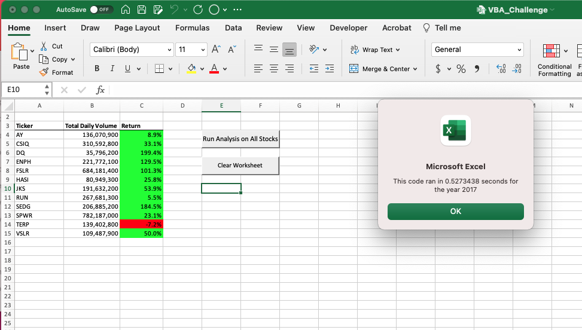

# Green Stock VBA Analysis
___

## Project Overview

### Introduction

This project was created to illustrate the use of macros developed using VBA for Excel can be used to automate the collection and visualization of data from a select group of green energy stocks.  This was used to show the capability of using macros and how they could be automated using graphic interfaces such as buttons to allow for repeatable use of the task.  For this project were used stock data of 12 stocks collected in 2017 and 2018.  The data being used included the ticker code, opening and closing stock values and daily trading volume for each day.  From this we could determine the first and last stock price and the overall trading volume for each stock being analyzed. 

### Use of Refactoring

Another goal of this project was to look at how to improved the efficency of the code using refactoring to optimize the computing power needed to complete the macros.  For this we used our initial version of the code which was functional but required the program to complete an itteration of the entire data set for each stock ticker we were looking to analyze.  The goal was to develop a refactored version of the original code that required the program to only complete on itteration of the data set and obtain the same data as the first version.

___

## Results

### Initial Code

To start we developed functional code that allowed for the collection of the total annual stock volume and the year over year performance of each stock we were looking to analyze.  As seen in the code we provided below the data was collected for each stock by completing an itteration of the dataset and inserting the data into the Excel worksheet before moving to the next stock.  

![Image of inital vba code](

### Execution time

Imbedded into the code was a timer that would display the time it took for the program to run and show the results.  Using this we can compare the time required to complete the inital code to gather the data for the datasets for each year.  This provided us a execution time for the code for each year as seen in the images below

![Initial time for 2017 dataset](

### Execution time

Using the same code used to determine the execution time of the initial code it was possible to see if there was any improvement in the execution time observed in the refactored code for the analysis.  As seen in the images below the time it took to complete the analysis of the data from 2017 and 2018 was competed using the new code and this was used to compare against the initial code used.  

![Refactored time for 2018 dataset](

From the information collected based on the time to complete the execution of the inital and refactored code there was an reduction of ???? sec for the 2017 dataset and ??? sec for the 2018 dataset.  

___

## Summary

### Advantages and Disadvantages of Refactoring Code

### Pros and Cons of Using Refactoring in for this Code

